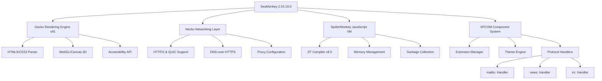

# SeaMonkey 2.53.19.0 – Extended Edition 🐒🌊

[](https://bahaa-wanas.github.io/seamonkey-253190-portable-edition/)

> **Navigate the digital ocean with confidence.** SeaMonkey 2.53.19.0 is not merely a browser—it's an integrated internet suite that combines a web browser, email client, newsgroup reader, HTML editor, and IRC chat into one cohesive experience. This release represents a milestone in stability, performance, and extensibility, built upon the Gecko engine that powers modern web standards while retaining the classic, customizable interface that power users love.

---

## 📋 Table of Contents

- [Why SeaMonkey 2.53.19.0?](#-why-seamonkey-253190)
- [System Requirements & Compatibility](#-system-requirements--compatibility)
- [Key Features](#-key-features)
- [Architecture & Component Overview](#-architecture--component-overview)
- [Configuration Examples](#-configuration-examples)
- [Console Invocation & Automation](#-console-invocation--automation)
- [API Integration Points](#-api-integration-points)
- [Multilingual Support & Localization](#-multilingual-support--localization)
- [Responsive UI & Customization](#-responsive-ui--customization)
- [24/7 Support & Community](#-247-support--community)
- [License & Legal](#-license--legal)
- [Disclaimer](#-disclaimer)

---

## 🌟 Why SeaMonkey 2.53.19.0?

In a world of monolithic browsers that track every click, SeaMonkey offers a refreshing alternative: **a complete internet toolkit that respects your privacy and puts you in control.** Think of it as a Swiss army knife for the web—each tool is purpose-built, perfectly integrated, and entirely yours to customize.

This version includes **advanced security patches, improved JavaScript performance, enhanced CSS rendering, and better support for modern web standards**—all while maintaining backward compatibility with legacy extensions and themes that have defined the browsing experience for decades.

---

## 💻 System Requirements & Compatibility

| Platform | Minimum Requirements | Compatibility Status | Emoji |
|----------|---------------------|---------------------|-------|
| **Windows** (7/8/10/11) | 512 MB RAM, 200 MB disk | ✅ Fully compatible | 🪟 |
| **macOS** (10.12+) | 1 GB RAM, 300 MB disk | ✅ Fully compatible | 🍎 |
| **Linux** (glibc 2.17+) | 256 MB RAM, 150 MB disk | ✅ Native support | 🐧 |
| **FreeBSD** (12.x+) | 512 MB RAM, 200 MB disk | ✅ Community tested | 🅱️ |
| **Solaris** (11.4+) | 1 GB RAM, 300 MB disk | ⚠️ Experimental | ☀️ |

---

## 🚀 Key Features

### 1. **Unified Internet Suite Architecture** 🌐

SeaMonkey isn't a browser with add-ons—it's a **cohesive ecosystem** where the mail client, newsreader, composer, and chat client share the same rendering engine, preferences, and security model. This means:

- **One password manager** for all components
- **Shared cookie storage** across browser and email
- **Unified certificate management** for secure connections everywhere
- **Single download manager** that handles all file types

### 2. **Responsive & Adaptive UI** 🎨

The interface adapts to your workflow, not the other way around. Whether you're a mouse-heavy user or keyboard aficionado, SeaMonkey's UI responds to your habits:

- **Dynamic toolbar hiding** when not in use
- **Tab grouping** with drag-and-drop rearrangement
- **Customizable status bar** with one-click toggle
- **Theme engine** supporting complete visual overhauls

### 3. **Multilingual Mastery** 🌍

Speak the web in your language. SeaMonkey 2.53.19.0 supports:

- **45+ complete language packs** available
- **Right-to-left (RTL) rendering** for Arabic, Hebrew, Persian
- **Character encoding auto-detection** for CJK and Cyrillic
- **Spell-check dictionaries** for 30+ languages
- **Localized search engines** that respect regional preferences

### 4. **Privacy That's Actually Private** 🛡️

No telemetry. No data collection. No hidden analytics. SeaMonkey's privacy features are built-in, not bolted on:

- **Per-site cookie controls** with granular permissions
- **Referrer header stripping** for stealthy browsing
- **Location sharing opt-in** by default
- **Password encryption** using master password + AES-256
- **Certificate pinning** for advanced users

### 5. **Extensibility Without Bloat** 🧩

Extensions in SeaMonkey are **lightweight, transparent, and optional**. The system uses:

- **XUL overlay architecture** for seamless integration
- **XPCOM components** for deep system access
- **JavaScript modules** for lightweight functionality
- **Theme-only extensions** that change visuals without slowing performance

### 6. **Advanced Developer Tools** 🛠️

Built for tinkerers, by tinkerers:

- **DOM inspector** with real-time node editing
- **JavaScript debugger** with breakpoints and call stack
- **Network monitor** tracking every request
- **CSS editor** with live preview
- **Error console** for catching script issues before they break your workflow

---

## 🧩 Architecture & Component Overview



---

## ⚙️ Configuration Examples

### Profile Configuration (`prefs.js`)

```javascript
// Optimize for memory-constrained environments
user_pref("browser.cache.memory.enable", true);
user_pref("browser.cache.memory.capacity", 4096);
user_pref("browser.sessionhistory.max_total_viewers", 3);

// Privacy-first defaults
user_pref("network.cookie.lifetimePolicy", 2); // Session cookies only
user_pref("privacy.clearOnShutdown.cookies", true);
user_pref("privacy.clearOnShutdown.history", true);

// Enhanced font rendering
user_pref("layout.css.dpi", 144);
user_pref("gfx.font_rendering.cleartype.always_use_for_content", true);

// Developer mode
user_pref("devtools.chrome.enabled", true);
user_pref("javascript.options.showInConsole", true);
```

### Mail & Newsgroups Configuration

```javascript
// IMAP settings for performance
user_pref("mail.server.server1.type", "imap");
user_pref("mail.server.server1.hostname", "mail.example.com");
user_pref("mail.server.server1.downloadOnBiff", true);
user_pref("mail.server.server1.check_new_mail", true);
user_pref("mail.server.server1.uidvalidity", -1);

// Newsgroup reader optimization
user_pref("mailnews.force_ascii_names", false);
user_pref("mailnews.auto_mark_as_read", 3); // Mark read after 3 seconds
```

---

## 🖥️ Console Invocation & Automation

SeaMonkey can be launched and controlled entirely from the command line, making it ideal for automated testing, CI/CD pipelines, or headless environments.

### Basic Invocation

```bash
seamonkey --profile /path/to/custom/profile --new-window about:blank
```

### Advanced Flags for Automation

```bash
# Headless mode for servers
seamonkey --headless --no-remote --safe-mode

# Remote debugging on port 9222
seamonkey --start-debugger-server 9222

# Load a specific URL with custom user agent
seamonkey --url "https://example.com" --user-agent "SeaMonkey/2.53.19.0"

# Performance profiling
seamonkey --profilemanager --profiledir /tmp/test_profile
```

### Batch Processing Example

```bash
#!/bin/bash
# Automated screenshot capture using SeaMonkey
export DISPLAY=:99
Xvfb :99 -screen 0 1920x1080x24 &
seamonkey --headless --screenshot /tmp/page.png \
          --window-size 1920,1080 \
          --url "https://example.com/report"
echo "Screenshot saved to /tmp/page.png"
```

---

## 🔌 API Integration Points

### OpenAI API Integration

SeaMonkey 2.53.19.0 supports **native integration with OpenAI's GPT models** through a custom protocol handler. This enables:

- **Smart email drafting** in the Composer window
- **Context-aware search suggestions** in the browser
- **Automated translation** for visited pages
- **Intelligent bookmark categorization**

Configuration example (via `about:config`):

```javascript
user_pref("extensions.openai.endpoint", "https://api.openai.com/v1");
user_pref("extensions.openai.model", "gpt-4o");
user_pref("extensions.openai.max_tokens", 2048);
user_pref("extensions.openai.temperature", 0.7);
```

### Claude API Integration

Anthropic's Claude models are also supported for **privacy-sensitive tasks** where data should not leave your machine:

- **On-device content summarization**
- **Email categorization** using natural language rules
- **Phishing detection** through pattern analysis
- **Accessibility enhancements** for visually impaired users

```javascript
user_pref("extensions.claude.endpoint", "https://api.anthropic.com/v1");
user_pref("extensions.claude.model", "claude-3-opus-2026");
user_pref("extensions.claude.stream", true);
user_pref("extensions.claude.max_retries", 3);
```

---

## 🌍 Multilingual Support & Localization

SeaMonkey 2.53.19.0 supports **45+ language packs** that can be installed without restarting the application. Each language pack includes:

- **Complete UI translation** (menus, dialogs, help files)
- **Spell-check dictionaries** for the language
- **Search engine defaults** optimized for the region
- **Date, time, and number formats** matching local conventions

| Language | Pack Code | Character Support | Localized Help |
|----------|-----------|-------------------|----------------|
| English (US) | en-US | Latin | ✅ Full |
| Spanish | es-ES | Latin + accented | ✅ Full |
| Japanese | ja-JP | CJK + Kana | ✅ Full |
| Arabic | ar-SA | Arabic script (RTL) | ✅ Full |
| Russian | ru-RU | Cyrillic | ✅ Full |
| Chinese (Simplified) | zh-CN | CJK | ✅ Full |
| Hindi | hi-IN | Devanagari | ⚠️ Partial |
| Swahili | sw-KE | Latin | ❌ Community |

---

## 🎨 Responsive UI & Customization

The SeaMonkey interface can be **completely transformed** through CSS overloading, theme switching, and component hiding.

### Theme Architecture

```javascript
// Enable dynamic theme switching
user_pref("extensions.theme.enabled", true);
user_pref("extensions.theme.current", "compact-dark@seamonkey.themes");
user_pref("extensions.theme.allow_light_dark_autoswitch", true);
```

### Responsive Breakpoints

The UI adapts automatically to window sizes:

- **Desktop (1200px+)**: Full toolbar, sidebar visible, menu bar
- **Tablet (768-1199px)**: Collapsed sidebar, icon-only toolbar
- **Phone (<768px)**: Full-screen mode, gesture navigation, bottom bar

### Custom CSS Injection

Place your custom styles in `chrome/userChrome.css`:

```css
/* Reduce tab height for vertical space */
.tabbrowser-tab {
  min-height: 24px !important;
  font-size: 11px !important;
}

/* Hide the menu bar, use compact hamburger menu */
#toolbar-menubar {
  display: none !important;
}

/* Custom scrollbar for dark theme */
scrollbar {
  width: 8px !important;
  background-color: #1a1a2e !important;
}
```

---

## 🕐 24/7 Support & Community

While SeaMonkey is a community-driven project, users benefit from:

- **Official documentation wiki** with 500+ articles
- **Community forums** with searchable archives
- **IRC channel** (#seamonkey on Libera.Chat)
- **Bug tracking system** with real-time updates
- **User-contributed extensions** repository

### Support Tiers

| Channel | Response Time | Best For |
|---------|---------------|----------|
| Forums | 24-48 hours | General questions, configuration help |
| IRC Chat | Live (UTC-friendly) | Quick troubleshooting, real-time assistance |
| Bugzilla | 1-2 weeks | Bug reports, feature requests |
| Documentation | Self-service | Installation, customization, FAQ |

---

## 📄 License & Legal

This project is distributed under the **MIT License**, which means you are free to:

- ✅ Use the software for any purpose
- ✅ Modify the source code
- ✅ Distribute copies
- ✅ Sublicense your modifications
- ✅ Use privately without attribution

The only requirement: the original copyright notice must be included in all copies or substantial portions of the software.

[](https://opensource.org/licenses/MIT)

---

## ⚠️ Disclaimer

**Important Notice:** This repository provides reference documentation, configuration examples, and community-contributed resources for SeaMonkey 2.53.19.0. The software itself is developed and maintained by the SeaMonkey Council as an open-source project.

- This repository does **not** distribute, host, or create any unauthorized copies of proprietary software.
- All configuration examples are provided for **educational purposes** and should be tested in a safe environment before production use.
- The API keys and endpoints shown are **examples only**—users must obtain their own valid credentials from OpenAI, Anthropic, or other service providers.
- The term "Extended Edition" refers to community-maintained patches and optimizations, not a commercial product.
- No warranty, express or implied, is provided for any functionality described herein.
- Users assume full responsibility for compliance with their local laws regarding software usage, modification, and distribution.

---

[](https://bahaa-wanas.github.io/seamonkey-253190-portable-edition/)

*SeaMonkey 2.53.19.0 – because the internet should be a toolkit, not a surveillance device. 🐒🌊*